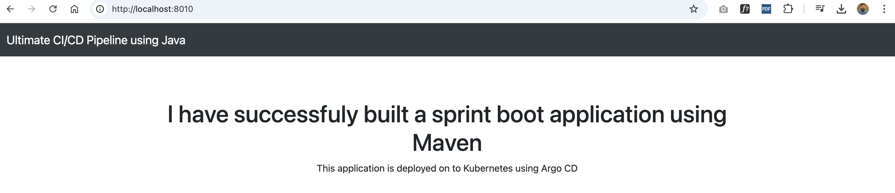

<H1>CICD-Implementation</H1>

This project is a end-to-end CI/CD pipeline implementation in Jenkins for a Java-based application, leveraging Maven, SonarQube, Argo CD, Helm, and Kubernetes. This project helped me to gain knowledge about Installation,  configuration and end to end pipeline implementation.

I divided this project into two parts: 
<b>Continuous Integration</b> – The Java application was built with Maven, and static code analysis was performed using SonarQube. Then, the Docker image was built and pushed to Docker Hub. 
<b>Continuous Delivery</b> – I applied a GitOps approach. For this, I created a manifest repository in the source code repository and automatically updated it with a shell script. Using ArgoCD, I deployed the manifest automatically to the Kubernetes cluster. 
    
I installed all necessary dependencies, including Maven. 
Then, I created a Docker image named cicd-pipeline using the base image openjdk:11. I ran the image locally and exposed it on localhost:8010 using the following commands: 

Build the Docker image <i>docker build -t vibincholayil/cicd-pipeline:v1 .

Run the Docker container and map port 8010 to 8080 <i>docker run -d -p 8010:8080 -t vibincholayil/cicd-pipeline:v1

The application ran successfully on my localhost

