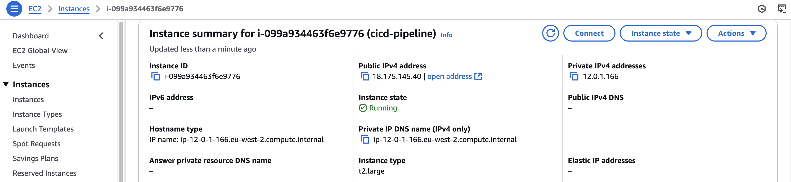
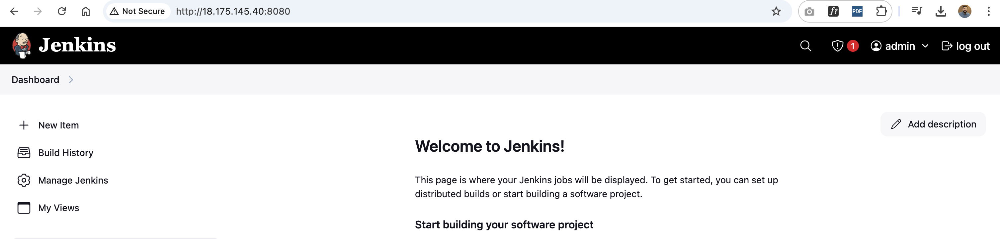
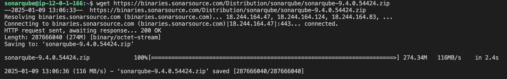
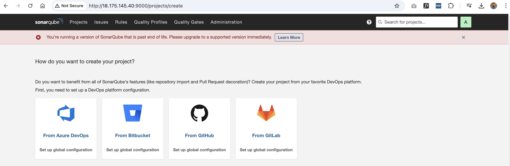
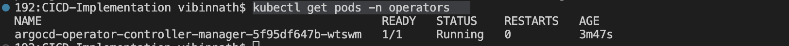
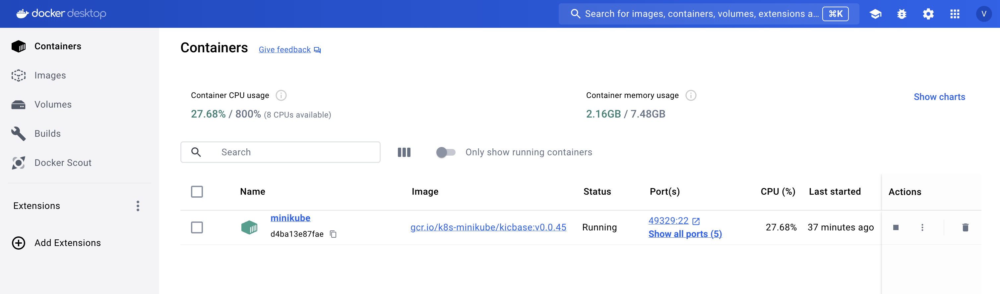
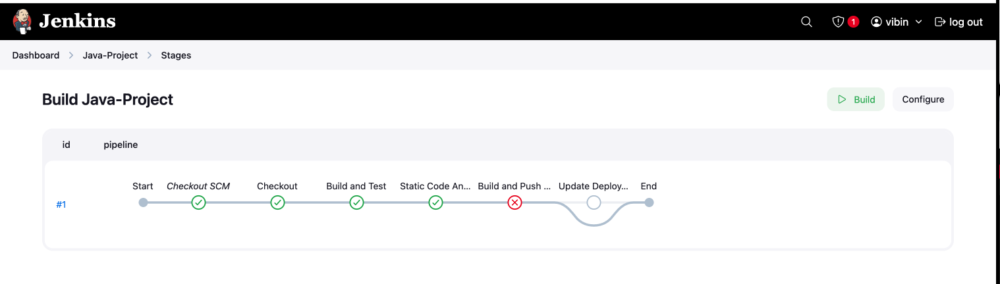
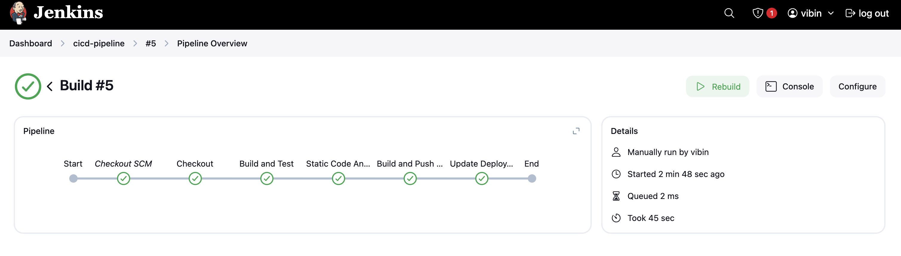
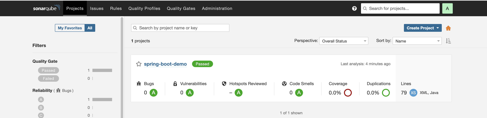
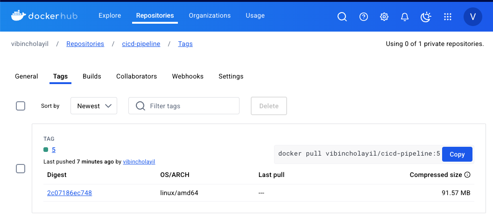

# CICD-Implementation
This project is a end-to-end CI/CD pipeline implementation in Jenkins for a Java-based application, leveraging Maven, SonarQube, Argo CD, Helm, and Kubernetes. This project helped me to gain knowledge about Installation,  configuration and end to end pipeline implementation.

**I divided this project into two parts:**
Continuous Integration – The Java application was built with Maven, and static code analysis was performed using SonarQube. Then, the Docker image was built and pushed to Docker Hub. 
Continuous Delivery – I applied a GitOps approach. For this, I created a manifest repository in the source code repository and automatically updated it with a shell script. Using ArgoCD, I deployed the manifest automatically to the Kubernetes cluster.
    
I installed all necessary dependencies, including Maven.
Then, I created a Docker image named cicd-pipeline using the base image openjdk:11. I ran the image locally and exposed it on localhost:8010 using the following commands:

Build the Docker image <i>docker build -t vibincholayil/cicd-pipeline:v1 .

Run the Docker container and map port 8010 to 8080 <i>docker run -d -p 8010:8080 -t vibincholayil/cicd-pipeline:v1

The application ran successfully on my localhost

**Project Start: Below, I explain how to run this in a CI/CD pipeline.**

**Creating an EC2 Instance**
I have set up an EC2 instance with the instance type t2.large, running the Ubuntu operating system. This configuration is chosen to ensure sufficient storage and resources for managing the demanding configurations required for this project.

Then, i have SSH-ed into the AWS server, updated the Ubuntu operating system, and installed Jenkins on it. Additionally, I installed the 'Docker Pipeline' and 'SonarQube Scanner' plugins in Jenkins.

Started SonarQube and connected it to Jenkins using a Sonar token.

Then,i installed Docker and granted both the Jenkins user and the Ubuntu user the necessary permissions to access the Docker daemon. After completing all the Jenkins configurations, I restarted the Jenkins service for the first time to apply the changes.

After that Install Kubernetes and ArgoCD
After that, I installed Kubernetes and ArgoCD, using the installation links provided on OperatorHub for setting up ArgoCD.

**Minikube is running on Docker.**

**Unfortunately, this time the build failed. I debugged the issue and identified the problem, then rectified it with the help of ChatGPT. The issue was due to a Jenkinsfile error, which I have fixed, and I ran the build again.**

**Sonarqube test passed**

**Shell script updated the repo**

